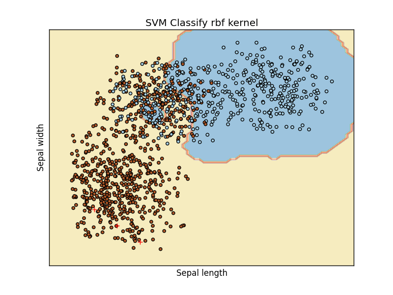
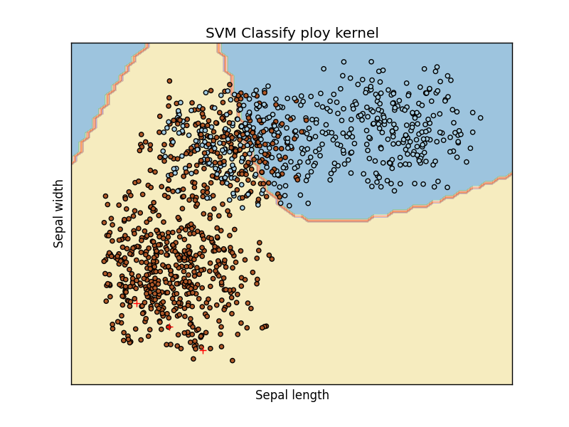

# Score the human figure

- openCV
- SVM

#### Original Image

### Remove Background

### Contour the Image

### Calculate the Score of Object

| 1 | 2 | 3 | 4 | 5 | 6 | grade |
| :---: | :---:| :---: | :---:| :---: | :---: | :---: |
| 2.36666666667 | 3.26666666667 | 2.36666666667 | 1.96666666667 | 1.86666666667 | 1.6 | a |
| 1.52542372881 | 5.47457627119 | 6.06779661017 | 4.03389830508 | 2.36666666667 | 2.5 |  a |
| 3.61111111111 | 9.66666666667 | 8.27777777778 | 4.94444444444 | 3.77777777778 | 1.72222222222 | a |
| 4.44444444444 | 9.66666666667 | 13.8888888889 | 15.1111111111 | 12.6666666667 | 10.6111111111 | c |
| 8.8 | 10.2666666667 |10.0666666667 | 6.66666666667 | 6.66666666667 | 6.33333333333 | c |

### Classify the result

Use SVM to classify the figure

SVM Linear kernel

SVM RBF kernel

SVM poly kernel

### References

http://docs.opencv.org/2.4/doc/tutorials/imgproc/opening_closing_hats/opening_closing_hats.html
http://stackoverflow.com/questions/31133903/opencv-remove-background
http://scikit-learn.org/stable/modules/svm.html
https://docs.scipy.org/doc/numpy-dev/user/quickstart.html
http://scikit-learn.org/stable/auto_examples/svm/plot_iris.html
