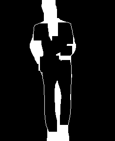

# Score the human figure

- openCV
- machine learning method

#### More Morphology Transformations

### References

http://docs.opencv.org/2.4/doc/tutorials/imgproc/opening_closing_hats/opening_closing_hats.html

http://stackoverflow.com/questions/31133903/opencv-remove-background

